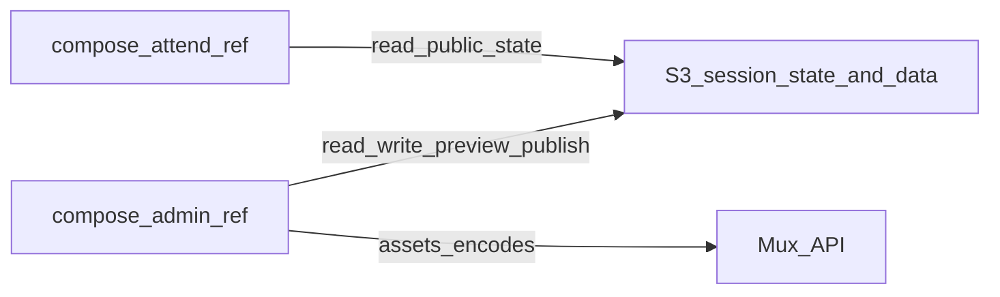

# Specifications: compose-admin-ref-1a-aws-nuxt-mux

- Spec for the reference **administration** Nuxt app (AWS, Nitro, Mux).
- Phases: [dev-plan.md](./dev-plan.md).
- Pairs with the attendee reference app: [compose-attend-ref-1a-aws-nuxt-mux spec README](../../compose-attend-ref-1a-aws-nuxt-mux/spec/README.md).

## Purpose

- Reference app for **operators** who manage session data, session **state** (including preview → publish), and **Mux**-related workflows for the same meeting model as the attendee app.
- Layering follows [README.md](../../../README.md) and [package-directory.md](../../../package-directory.md) (UTILS, CORE, FRAME, PROVIDE, COMPOSE, DEVELOP, DEPLOY, BUILD). Naming aligns with the planned `compose-ref-admin-aws-nuxt-mux` entry in package-directory.

## Relationship to attend (pairing)

- **[compose-attend-ref-1a-aws-nuxt-mux](../../compose-attend-ref-1a-aws-nuxt-mux/spec/README.md)** reads **published** session payloads and public session state; it does not perform ingest, admin state writes, or Mux asset management (see that spec’s “Out of scope”).
- **This app** is the intended surface for **writing** preview state, promoting state to public, and optional encode / QC / stream-discovery workflows that feed the data attend consumes.

## Out of scope (initial)

- Built-in Q&A, chat, or polling product (same as attend: external links from data only).
- **End-user** attendee UX (live layouts, public timeline pages); that remains attend’s job.
- Full CRM, registration, or arbitrary non–video-meeting admin unless added explicitly later.
- Hardcoded meeting IDs, titles, Mux asset IDs, or stream mappings in source (use `runtimeConfig` / `app.config`, storage, or dev fixtures).

## Meeting context (Nitro)

- Same **meeting-level dependency injection** idea as attend: handlers resolve **`mtSlug`** → meeting context instead of ad hoc globals.
- **`roleName`:** **`ROLE_NAME_ADMIN`** (see [`app-env.ts`](../../../packages/core/src/app-env.ts)).
- **`applName`:** **TBD** — document here when chosen; promote to `@mtngtools/core` as a named constant when stable (parallel to attend’s `APPL_NAME_WATCH` discussion in [attend meeting-context](../../compose-attend-ref-1a-aws-nuxt-mux/spec/meeting-context.md)).
- Admin-specific capabilities (read/write state, Mux, optional Lambdas): [meeting-context.md](./meeting-context.md).

## TEMPORARY: Inspiration until spec is complete (`croi-virt-admin`)

The client app [croi-virt-admin](../../../../../clients/croi-virt-admin) is **inspiration only**. It demonstrates useful workflows (session timeline UI, preview routes, Mux batch encode, streams/records, transfer). This reference spec and a future implementation must **not** inherit its stack or habits wholesale:

| Keep (ideas) | Avoid (anti-patterns) |
|--------------|----------------------|
| Session admin shell with timeline / steps (live → archive → encode → release) | Legacy **`@mtng/*`** imports; use **`@mtngtools/core`**, **`@mtngtools/core-admin`**, **`@mtngtools/provide-aws`**. |
| Read APIs compatible with attend (`SessionWithPres`, public `SessionBaseState`) | Hard-coded conference titles or IDs in pages/components. |
| Optional preview → public promotion, Mux QC page, stream/record discovery | **`as unknown`** or untyped `useFetch`; types must come from shared packages. |
| Thin Nitro handlers delegating to context + storage | Ad hoc utility walls without a Tailwind / layout system; prefer tokens and shared layout patterns. |

## In scope (high level; MVP vs later)

Grouping matches likely implementation order; exact routes and signatures are **TBD** until detailed spec passes.

### MVP (candidate)

- **Meeting context** plugin: **`getMeetingContext(mtSlug)`** with read **`getSession`**, **`getSessionState`** (including preview scopes where applicable) and **write** capabilities for session state as agreed in [meeting-context.md](./meeting-context.md).
- **Session admin entry**: one or more pages under **`/[mtSlug]/...`** that load session + state via `useFetch` (or equivalent) with package types; **page title / meeting copy from config**, not literals.
- **Preview → public** (or equivalent) workflow at the API level, aligned with how attend loads public state (see attend [state session API](../../compose-attend-ref-1a-aws-nuxt-mux/spec/README.md#get-apimtslugstatesessionssslug)).

### Later / optional (candidate)

- **Mux**: asset creation, batch encode, playback QC (e.g. `lv/mux/[id]`-style, non-prod-only via config); prefer future **`provide-mux`** / **`frame-vue-mux`** over one-off server utils.
- **Streams / rooms**: list streams, per-room record listings (operator discovery).
- **Transfer / Lambda**: HLS or m3u8-to-S3 style jobs; Lambda names and IAM from **config / recipe**, not source literals.

## User HTTP entry points (Nuxt page routes)

#### Common to all pages below

- Nuxt **pages** and **`use[PageType]Page`** (or similarly named) composables that load from [API](#api-nitro-server-routes) with types from **`@mtngtools/core`** / **`@mtngtools/core-admin`**.
- Paths use **`mtSlug`**, **`ssSlug`**, and optionally **`rmSlug`**, **`plSlug`**, etc., consistent with API segments.
- Subsections **Data** / **UI** per page when this spec is expanded.

### `PAGE` session admin hub (TBD path)

- **Data:** session payload and state (preview and/or public, per query or route convention).
- **UI:** timeline or stepper for operator workflow (croi-style `SessionManageTimeline` pattern, reimplemented cleanly).

### `PAGE` Mux / encode workflow (TBD path)

- **Data:** session, selected assets/records, encode batch inputs — types from core / core-admin.
- **UI:** players, chapter/encode controls as spec’d later.

### `PAGE /lv/mux/[id]` (optional)

- Mux playback for QC; off or non-prod-only via config (same idea as attend spec).

---

## API (Nitro server routes)

#### Common to all handlers below

- First segment after `/api/` is **`mtSlug`**; session routes use **`ssSlug`** as in attend.
- **`200`:** JSON unless noted; **`404`** when required objects are missing or unusable.
- Handlers stay **thin**: meeting context + `@mtngtools/provide-aws` (and later `provide-mux`).

### Read (align with attend)

- **`GET /api/:mtSlug/session/:ssSlug`** — `SessionWithPres`; same contract as [attend spec](../../compose-attend-ref-1a-aws-nuxt-mux/spec/README.md#get-apimtslugsessionssslug).
- **`GET /api/:mtSlug/state/session/:ssSlug`** — `SessionBaseState` for public scope by default; optional **`ovrd`**, **`version`** query params as in attend for overrides.

### Write / operator (TBD detail)

- Preview state writes (e.g. timeline-scoped POST under `state/session/.../preview/...`).
- Promote preview → public (POST).
- Mux batch / asset routes as needed; signatures TBD.
- Streams / transfer routes optional per [In scope](#in-scope-high-level-mvp-vs-later).

---

#### Client

- `useFetch` (or equivalent) with shared types; `mux-player` via `@nuxt/scripts` (or equivalent) where playback is needed.
- Tailwind aligned with other mtng Nuxt apps; consistent layout components rather than one-off class strings.

---

#### Runtime configuration

- **AWS / Nitro:** data, cache, resources (and media if used); Lambda names for transfer jobs.
- **Mux:** API credentials via server `runtimeConfig` only.
- **Public:** `orgDir`, `opEnv`, CDN base; **App:** display metadata; **Secrets:** never exposed to client.

---

#### S3 / storage

- This app **reads and writes** objects attend depends on (within IAM boundaries). Key layout lives in meeting-context implementation; document concrete prefixes when finalized.

---

#### Deployment

- Same broad approach as attend (Lambda preset, CDN, AWS SDK externals as needed).
- IAM must include **write** paths used by preview/publish and any ingest routes; Mux API usage documented per recipe.

---

#### Security

- **Operator auth** is expected for production (mechanism **TBD**: Cognito, OIDC, etc.); unlike attend’s public viewer surface.
- Avoid logging PII; protect Mux and AWS secrets.

---

#### See also

- [Repo README.md](../../../README.md), [GLOSSARY.md](../../../GLOSSARY.md), [package-directory.md](../../../package-directory.md)
- [Attend spec README](../../compose-attend-ref-1a-aws-nuxt-mux/spec/README.md), [Attend meeting-context](../../compose-attend-ref-1a-aws-nuxt-mux/spec/meeting-context.md)
- [Spec dev-plan.md](./dev-plan.md), [Spec meeting-context.md](./meeting-context.md)
